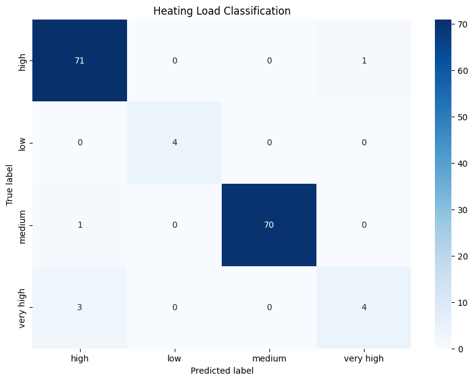
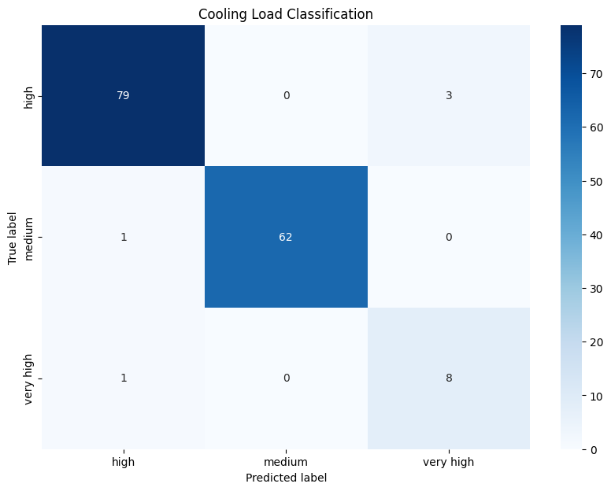
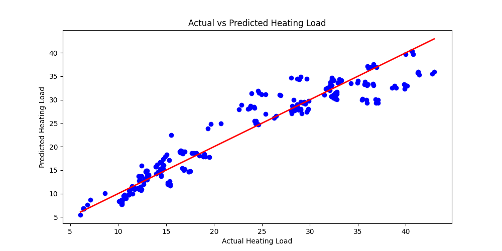
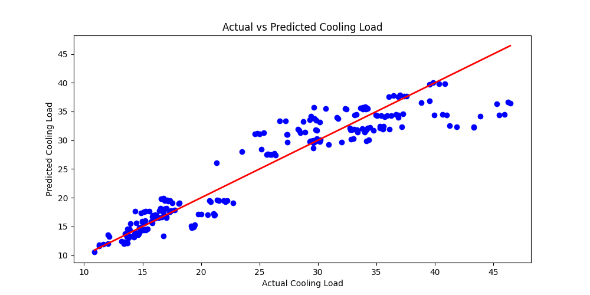

## Project
Building energy efficiency  

## Info
To address the problem of energy performance of buildings (EPB) due to growing concerns negative environmental impact of energy waste, one way to alleviate the ever increasing demand for additional energy supply for the robust implementation of energy-efficient building design. The computation of the heating load (HL) and the cooling load (CL) is required to determine the specifications of the heating and cooling equipment needed to maintain comfortable indoor air conditions, and in applying machine learning capabilities, this computational work can be done in a way that promotes data-driven insights into building design, and may produce value in increased building energy efficiency through reducing time and resources it may take to conduct necessary computations or simulations for determining better building efficiencies.  

So, using building heating and cooling data, the idea's to predict the heating and cooling needs of a building, to gauge means of improving efficiency.  

### Models
* Classification
* Regression  

### Performance
* Both algorithms perform well, given the confusion matrices and graphs showing good accuracy in prediction
    * The confusion matrix (classification) shows that it correctly classifies each label most of the time, with a few outliers
    * It also shows good predictive capabilities with the actual vs predicted graphs (regression), as most points are close to $x=y$ curve that shows the ideal scenario
  

### Classification
#### Confusion matrices:
  
  

### Regression
#### Actual vs Prediction:
  
  

### Application
#### Practical:
* (Efficient) Assessment of heating and cooling needs of building designs
* Plan renovations and improvements for existing buildings to move them to a lower energy load category
* Optimize building features such as insulation, orientation, and glazing area to achieve better energy efficiency   

## Notebook
https://colab.research.google.com/drive/1Jd-zffd6wJn10naXk3p-ssDY1vl7RN_h  

## References
Accurate quantitative estimation of energy performance of residential buildings using statistical machine learning tools. 
By A. Tsanas, Angeliki Xifara. 2012

Published in Energy and Buildings, vol. 49 

Link: https://archive.ics.uci.edu/dataset/242/energy+efficiency