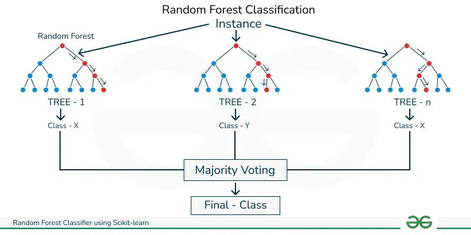

## Project
Building Energy Efficiency<br><br>

## Info
To address the problem of energy performance of buildings (EPB) due to growing concerns negative environmental impact of energy waste, one way to alleviate the ever increasing demand for additional energy supply for the robust implementation of energy-efficient building design.<br>

The computation of the heating load (HL) and the cooling load (CL) is required to determine the specifications of the heating and cooling equipment needed to maintain comfortable indoor air conditions, and in applying machine learning capabilities, this computational work can be done in a way that promotes data-driven insights into building design, and may produce value in increased building energy efficiency through reducing time and resources it may take to conduct necessary computations or simulations for determining better building efficiencies.<br><br>

#### Thermal computation:<br><br>
<br><br>
*Figure 1 - Illustration of heating & cooling computation via computational fluid dynamic simulation of building.*<br><br>

So, using building heating and cooling data, the idea's to predict the heating and cooling needs of a building, to gauge means of improving efficiency.<br><br>

#### Correlation heatmap:<br><br>
<br><br>
*Figure 2 - Correlation heatmap of dateset variables.*<br><br>

Highly correlated value are closest to 1, and are more red, and less correlated are more blue and closer to -1. This informs key aspects of model selection, including feature selection, where features having high correlation with heating and cooling load target variables, are good candidates to be included in the model as they are most likely to have a significant impact on prediction.<br><br>

#### Boxplots:<br><br>
<br><br>
*Figure 3 - Boxplot of dateset variables.*<br><br>

Variables such as overall height, orientation, glazing area and so on are very tightly compact and have small ranges, indicating low variance in their data, whereas surface area, wall area, and roof area have higher values and larger ranges, indicating a higher variance in the dataset.<br><br>

### Models
* Classification<br><br>

<br><br>
*Figure 4 - Random forest classifier illustration.*<br><br>

A Random forest classifier creates a set of decision trees from a randomly selected subset of the training set. It collects votes from different decision trees to decide the final prediction.<br><br>

### Performance
* The confusion matrix shows that it correctly classifies each label most of the time, with a few outliers
<br><br>

### Classification
#### Confusion matrices:<br><br>
<br><br>
*Figure 5 - Heating load classification confusion matrix.*<br><br>

<br><br>
*Figure 6 - Cooling load classification confusion matrix.*<br><br>


#### Scores:<br><br>
```
Heating Load Classification Accuracy: 96.75%

+--------------+-------------+----------+------------+------------+
|              |   precision |   recall |   f1-score |    support |
|--------------+-------------+----------+------------+------------|
| high         |    0.946667 | 0.986111 |   0.965986 |  72        |
| low          |    1        | 1        |   1        |   4        |
| medium       |    1        | 0.985915 |   0.992908 |  71        |
| very high    |    0.8      | 0.571429 |   0.666667 |   7        |
| accuracy     |    0.967532 | 0.967532 |   0.967532 |   0.967532 |
| macro avg    |    0.936667 | 0.885864 |   0.90639  | 154        |
| weighted avg |    0.965974 | 0.967532 |   0.965676 | 154        |
+--------------+-------------+----------+------------+------------+

Cooling Load Classification Accuracy: 96.75%

+--------------+-------------+----------+------------+------------+
|              |   precision |   recall |   f1-score |    support |
|--------------+-------------+----------+------------+------------|
| high         |    0.975309 | 0.963415 |   0.969325 |  82        |
| medium       |    1        | 0.984127 |   0.992    |  63        |
| very high    |    0.727273 | 0.888889 |   0.8      |   9        |
| accuracy     |    0.967532 | 0.967532 |   0.967532 |   0.967532 |
| macro avg    |    0.90086  | 0.945477 |   0.920442 | 154        |
| weighted avg |    0.970914 | 0.967532 |   0.968706 | 154        |
+--------------+-------------+----------+------------+------------+

```
<br><br>

### Application
Through the test set, we get the following results,<br><br>

#### Actual vs Prediction:<br><br>
```
Predictions for Heating Load:

    Heating Load Class Heating Load Prediction
0               medium                  medium
1               medium                  medium
2                 high                    high
3            very high               very high
4               medium                  medium
..                 ...                     ...
149               high                    high
150               high                    high
151               high                    high
152               high                    high
153             medium                  medium

[154 rows x 2 columns]


Predictions for Cooling Load:

    Cooling Load Class Cooling Load Prediction
0               medium                  medium
1               medium                  medium
2                 high                    high
3            very high               very high
4               medium                    high
..                 ...                     ...
149          very high               very high
150               high                    high
151               high                    high
152               high                    high
153             medium                  medium

[154 rows x 2 columns]

```
<br>

From a sample of the predicted classes, we can demonstrate the predictive accuracy which seems to reflect the high computed accuracy of the model.<br><br>

#### Practical:
* (Efficient) Assessment of heating and cooling needs of building designs
* Plan renovations and improvements for existing buildings to move them to a lower energy load category
* Optimize building features such as insulation, orientation, and glazing area to achieve better energy efficiency<br><br><br>

## Notebook
https://colab.research.google.com/drive/1Jd-zffd6wJn10naXk3p-ssDY1vl7RN_h<br><br>

## References
Random Forest Classifier using Scikit-learn.<br>

Geeks for geeks.<br>

Link: https://www.geeksforgeeks.org/random-forest-classifier-using-scikit-learn/<br><br>

The 3 Biggest Trends in Building Simulation.<br>

By SimScale<br>

Link: https://www.simscale.com/blog/building-simulation/<br><br>

Accurate quantitative estimation of energy performance of residential buildings using statistical machine learning tools.<br>

By A. Tsanas, Angeliki Xifara. 2012<br>

Published in Energy and Buildings, vol. 49<br>

Link: https://archive.ics.uci.edu/dataset/242/energy+efficiency