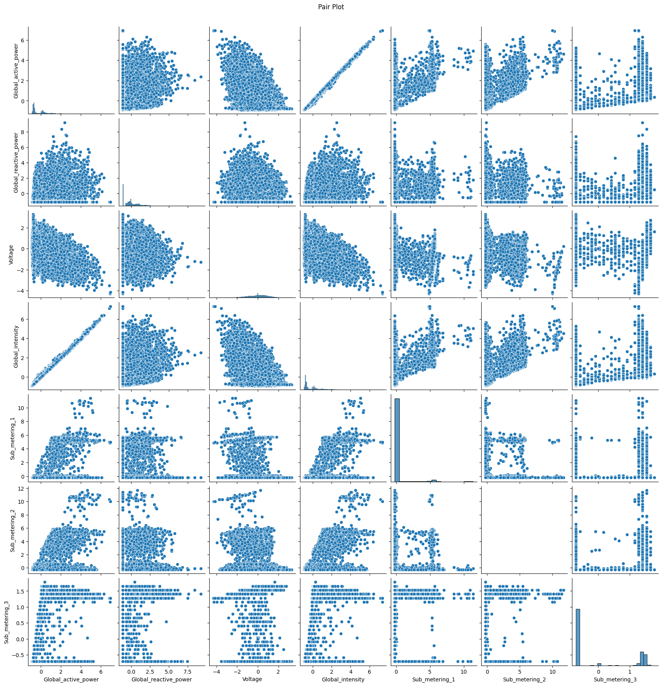
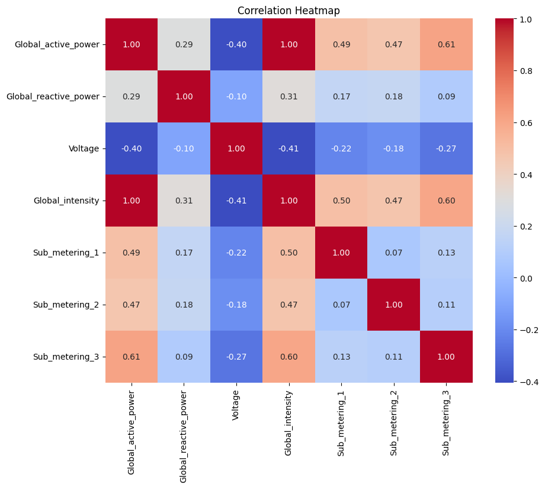

## Project
Electricity Metering Customer Segmentation<br><br>

## Info
Understanding the habits of energy consumers is essential in catering to their needs, and better anticipating their demand, to realize supply or generational efficiencies. Segmenting these customers can provide valuable insights on their habits, and this can be done through a k-means clustering algorithm.<br><br>

#### Metering diagram:<br><br>
<br><br>
*Figure 1 - Illustration of household metering data collection.*<br><br>

Metering data is used to achieve this segmentation, captured on different rooms of a house using different appliances, as well as electric water heater and air conditioners.<br><br>

There are two ways to determine correlated values,

#### 1. Pair plot:<br><br>
<br><br>
*Figure 2 - Pair plot of variables.*<br><br>

#### 2. Heatmap:<br><br>
<br><br>
*Figure 3 - Correlation heatmap of variables.*<br><br>

We can see that certain varaibles are highly correlated, including global active power and intensity, but some aren't like voltage and global intensity.<br><br>
This informs feature selection, and other means to optimize model performance.<br><br>

#### Ideal K:<br><br>
<br><br>
*Figure 4 - Elbow plot.*<br><br>

K-means clustering requires a n_clusters hyperparameter, which can be determined by creating an elbow plot of inertia (sum of squared distances between each point and the centroid of its assigned cluster) against the number of clusters k. As you increase the number of clusters k, the inertia decreases significantly because adding more clusters allows the model to better fit the data. However, after a certain point, the rate of decrease in inertia slows down significantly. The point where the rate starts to decrease more slowly (marked in blue) indicates that adding more clusters doesn't significantly improve the model's performance. This point is considered the 'elbow' and represents the ideal $k$.<br><br>


### Models
* K-means clustering<br><br>

<br><br>
*Figure 5 - Illustration of K-means clustering algorithm.*<br><br>

As eluded to in *Figure 5*, the model algorithmically clusters the data in steps, and mathematically this is done through minimizing an objective function $J$, which here being the squared error function:<br>

$$J = \sum_{i=1}^{k} \sum_{j=1}^{n} \left( \| x_i - v_j \| \right)^2$$
<br>

Where $x$ is a point, $v$ is a centroid, $k$ representing some number of centroids (clusters), and $n$ some number of points in each cluster.

<br><br>
### Performance
* Silohete score (this model'smodel: 0.408) that's closer to one like one above 0.5 is good, however this model performed below that, indicating poor cluster seperation quality<br><br>
* Davies-Bouldin index (this model's: 1.227) should ideally be low, which seems to be the case for this model, suggesting that the clusters have a moderate level of similarity to their nearest clusters.<br><br>

#### Performance metrics:<br><br>
```
Silhouette Score: 0.4081917719642258
Davies-Bouldin Index: 1.2269878058749135

```
<br><br>


### Application
If we apply the clustering algorithm, we get the following clusters, ranging from 0 -> 2:<br><br>

#### Clusters:<br><br>
<br><br>
*Figure 6 - K-Means clustering of data.*<br><br>

We have three clusters, each segmenting 3 different customer types:<br><br>
* Teal - Low consumption households, likely less popullated homes with few people or power consuming appliances <br><br>
* Purple - Medium consumption households, likely average households with balanced power usage. They might be typical family homes with moderate usage of kitchen appliances, laundry, and heating/cooling <br><br>
* Yellow - High consumption household, likely of larger households or homes with more appliances and higher overall electricity usage. They might also be running businesses from their homes or have large families <br><br>

With these segments, the utility company can more effectively make data-driven decisions affecting each segment, for instance, with higher consumption households, they may be made aware of methods to help make their energy consumption more economical, through smarter energy usages (using energy at off-peak times, through a brochure showing energy savings statistics for specific times of day), or more enticing incentives encouraging a more efficient and economical consumption pattern. <br><br>


## Interactive Application
* [Segementation Clustering Model](https://github.com/JeffM-Code/SegementationClusteringModel)<br><br>

#### Practical:
* Customer segmentation for delivery of targeted interventions informing economical energy use (cost-cutting saving measures for *appropriate* consumers)<br><br><br>

## Notebooks
[Static](https://github.com/JeffM-Code/PortfolioWork/blob/main/ML/CustomerSegmentation/ML_customer_segmentation.ipynb)<br><br>
[Interactive](https://colab.research.google.com/drive/1l4FFhhdfhxbs78oyYCS3Yn6kR-K6ca1y#scrollTo=Emc0LJ5bFiUC)<br><br>

## References
k-Means Clustering.<br>

Brilliant<br>

Link: https://brilliant.org/wiki/k-means-clustering/<br><br>

Segmenting household electricity customers with quantitative and qualitative approaches.<br>

By F Barjak, et al.<br>

Link: https://www.sciencedirect.com/science/article/pii/S1364032121012776#:~:text=Five%20key%20customer%20segments%20are,and%205%20stable%20and%20uninterested.<br><br>

Holistic Privacy for Electricity, Water, and Natural Gas Metering in Next Generation Smart Homes.<br>

By Cihan Kement, et al.<br>

Link: https://www.researchgate.net/figure/Residential-smart-electricity-water-and-gas-metering_fig1_340952876<br><br>

Household Electricity Consumption.<br>

Kaggle<br>

Link: https://www.kaggle.com/datasets/thedevastator/240000-household-electricity-consumption-records