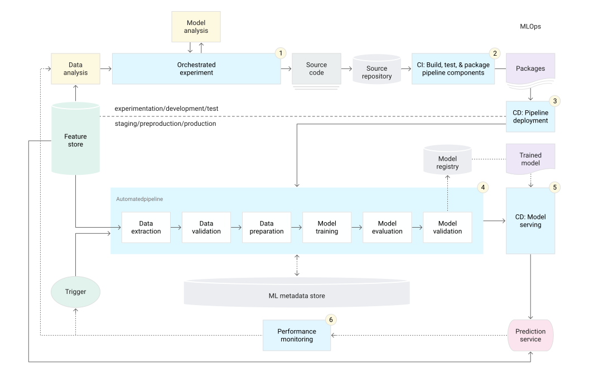
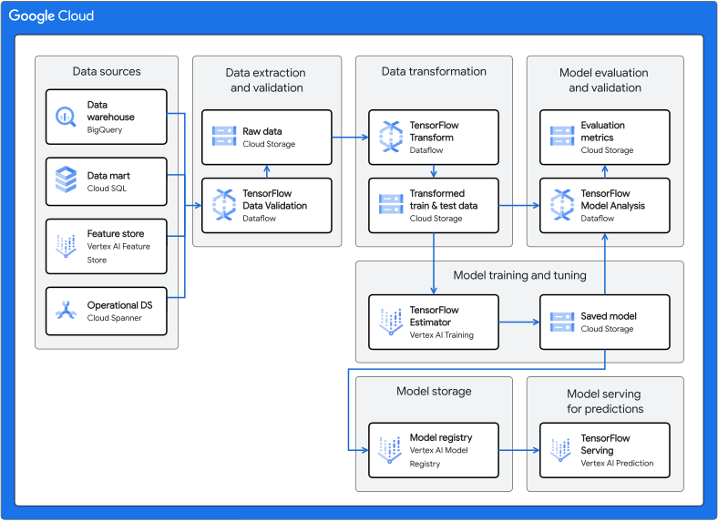

# Model Development Strategies
  Growing my understanding of MLOps has meant explicitly structuring my workflows in solving a given problem, to optimize chances of successful model experiments. So, I developed this workflow to help ensure consistency in the quality of my developed models.   

## Personal Workflow  
   
*Model development workflow**   

This is what I typically use to develop models, as I can use open-source tooling to implement it.  

However, cloud technologies (AWS, Azure, or GCP) are a better choice for production, as they can help automate most aspects of this workflow for greater efficiency and model performance. Therefore, I am constantly growing my cloud engineering skills to be able to architect end-to-end ML solutions in this way instead, as that provides a more robust solution for MLOps.  

Here is a general overview of MLOps more suitable for production models:  

## General  
   
*MLOps schematic: https://cloud.google.com/architecture/mlops-continuous-delivery-and-automation-pipelines-in-machine-learning*  

This would be a more robust pipeline for development, deployment and monitoring, including continous training capabilities to further the level of MLOps maturity.  

The following are illustrations of specific cloud solution architectures for highly mature MLOps processes:  

##  Azure  

   

*Azure MLOps architecture: https://techcommunity.microsoft.com/t5/ai-machine-learning-blog/mlops-maturity-model-with-azure-machine-learning/ba-p/3520625*   

##  AWS  

   

*AWS MLOps architecture: https://aws.amazon.com/blogs/machine-learning/automate-model-retraining-with-amazon-sagemaker-pipelines-when-drift-is-detected/*   

##  GCP  

   

*GCP MLOps architecture: https://cloud.google.com/architecture/architecture-for-mlops-using-tfx-kubeflow-pipelines-and-cloud-build*   

My goal is to apply cloud solution architectures to proposed problems through AWS, Azure or GCP to continuously evolve the maturity of my ML workflows.