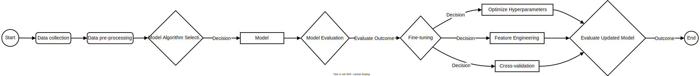

## Model development information
Growing my understanding of MLOps has meant explicitly structuring my workflows to solve a given problem. So, for each model developed, a problem was determined at the started, and solved at the end through a machine learning model, and data.  

#### Workflow:  
  
*General model development workflow*  

The question to be answered by an ML model is then packaged into an interactive application at the end, as I believe that helps any reader understand the output of the application, to understand the motivations underpinning its development.  

Next goal is to write code for an ML pipeline using sklearn.