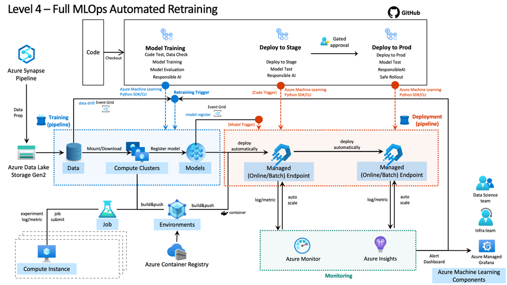
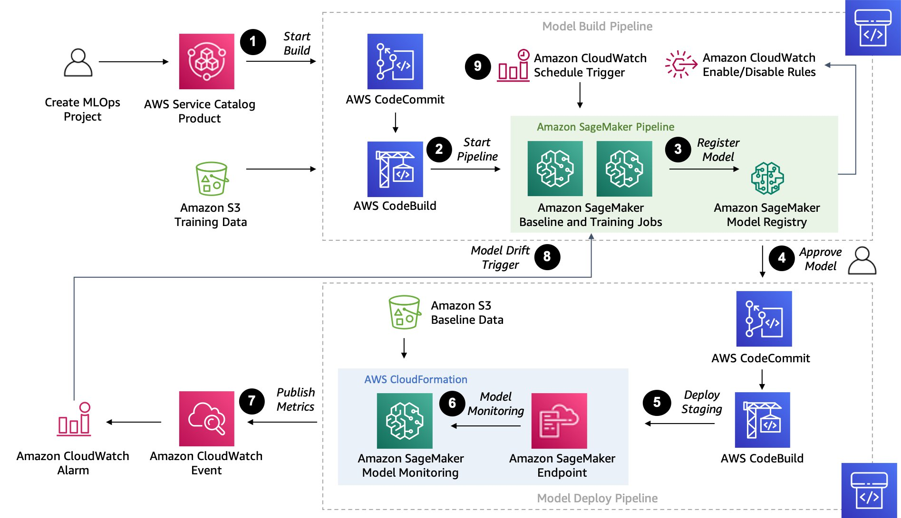

# Model Development
  Growing my understanding of MLOps has meant explicitly structuring my workflows in solving a given problem, to optimize chances of successful model experiments. So, I developed this workflow to help ensure consitency in the quality of my developed models.   

## Personal Workflow  
   
*General model development workflow**   

Utilization of cloud technologies (AWS, Azure, or GCP) can help automate most aspects of this workflow, for greater efficiency and model performance. I am constantly growing my Azure and AWS cloud engineering skills, so I hope to be able to architect end-to-end ML solutions in that way, as it's more robust.  

For instance, through Azure:  

##  Azure MLOps  

   

*Automated training workflow through Azure: https://techcommunity.microsoft.com/t5/ai-machine-learning-blog/mlops-maturity-model-with-azure-machine-learning/ba-p/3520625*   

And through AWS:  

##  AWS MLOps  

   

*Automated training workflow through AWS: https://aws.amazon.com/blogs/machine-learning/automate-model-retraining-with-amazon-sagemaker-pipelines-when-drift-is-detected/*   

My goal is to apply cloud solution architectures to proposed problems, with AWS and Azure.