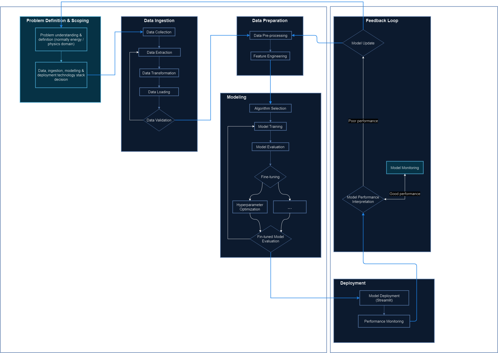

# Model Development  
Growing my understanding of MLOps has meant explicitly structuring my workflows to solve a given problem, to optimize chances of successful model experiments.   

## Workflow  
   
*General model development workflow**   

Utilization of cloud technologies (AWS, Azure, or GCP) can help automate most aspects of this workflow, for greater efficiency and model performance.  