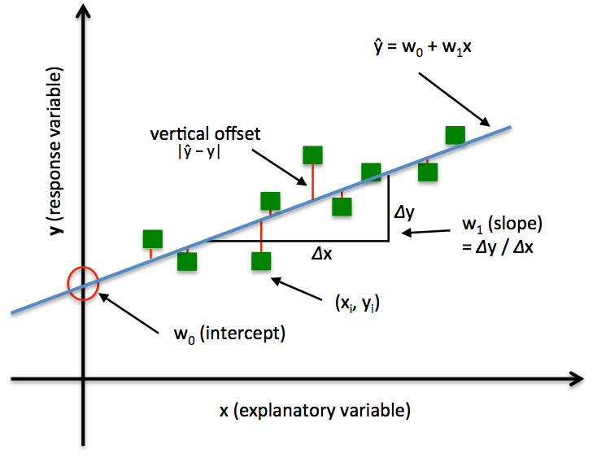

## Project
Micro Gas Turbine Energy Consumption<br><br>

## Info
Using data from an experiment done using a micro gas turbine, the idea's to predict its energy usage. This model can then help inform decisions on the tooling itself, as its performance can be emulated virtually via a predictive ML model, so it can be tested on a different environment and the results of that test can be treated as being reasonably accurate, depending on model performance on emulating its behavior in reality.<br><br>

#### Micro gas turbine:<br><br>
<br><br>
*Figure 1 - Micro gas turbine illustration.*<br><br>

Ideally more machinery or tooling can be more accurately simulated, to help inform decisions on their use, and drive business decisions. NVDIA seems to venture into simulation leveraging the power of machine learning as well (https://developer.nvidia.com/blog/develop-physics-informed-machine-learning-models-with-graph-neural-networks/), which personally I admire a lot and am trying to eventually get similar work done in the same area as well, starting with the applying ML to real-world systems and processes through my understanding of the field.<br><br>

#### Input voltage:<br><br>
<br><br>
*Figure 2 - Input voltage vs time plot.*<br><br>

#### Electrical power:<br><br>
<br><br>
*Figure 3 - Electrical power vs time plot.*<br><br>

The paper the data's based on asserts that the relationship between input voltage and electrical power is not one-to-one, but rather time-dependent and dynamic, meaning that the electrical power output is influenced by the input voltage, but it also exhibits temporal dynamics such as transitions and stationary phases, leading to the difference in geometric profiles.<br><br>
By analyzing these plots, one may determine a correlation between the input voltage and electrical power, or whether the relationship is more complex and involves time-dependent dynamics. However, the models developed will focus more on the power consumed by the turbine to attempt to accurately emulate its behavior.<br><br>

### Models
* Regression<br><br>

<br><br>
*Figure 4 - Illustration of linear regression.*<br><br>

Linear regression implements a means to perform ordinary least squares regression. In Ordinary Least Squares Linear Regression, the goal is to find the line that will minimize the vertical offsets (lines between points and best fit curve),  define the best-fitting line as the line that minimizes the sum of squared errors or mean squared error between our target variable $y$ and our predicted output over all samples in our dataset of size $n$.<br><br>

Sum of Squared Errors:<br>
$$SSE = \sum_{i=1}^{n} (y_i - \hat{y_i})^2 = \sum_i (target^{(i)} - output^{(i)})^2$$
<br>

Mean Squared Error:<br>
$$MSE = \frac{1}{n} \times SSE$$
<br>

Where $y$ is the explanatory variable or the value we're trying to predict, and $\hat{y}$ is the predicted value.<br><br>

### Performance
* The learning curves show that a steady validation error but an erratic training error, indicating sub-optimized model
    * Will need to implement model optimization techniques to ensure consistent and low error
* Error distribution is centered around zero, which is good, but should ideally be symmetrical around zero as well (is slightly left skewed)<br><br>

### Regression
#### Learning curve:<br><br>
<br><br>
*Figure 5 - Learning curve plot.*<br><br>

#### Error distribution:<br><br>
<br><br>
*Figure 6 - Prediction error distribution.*<br><br>

#### Scores:<br><br>
```
Mean Squared Error: 236800.6401296233
R^2 Score: 0.647773511404588

```
<br>

### Application
Using the test sets:<br>

#### Prediction 1:<br><br>
<br><br>
*Figure 7 - Predicted electrical power on test_1 dataset.*<br><br>

#### Prediction 2:<br><br>
<br><br>
*Figure 8 - Predicted electrical power on test_2 dataset.*<br><br>

It does well for both test sets, as predicted consumption curve is close to measured curve using for both.<br><br>

#### Practical:
* Predict future energy consumption based on past data, to enables better energy management and planning, helping utilities balance supply and demand
* Predict power requirements to manage battery charge and discharge cycles effectively, to help extend battery life and ensure reliable power supply in applications like electric vehicles and renewable energy storage<br><br><br>

## Notebook
https://colab.research.google.com/drive/1wD2YNJqh0A_YSL2IvcBuuTxrqtdLeyrE#scrollTo=y0Sa7Ikcbe0F<br><br>

## References
LinearRegression: An implementation of ordinary least-squares linear regression.<br>

Mlxtend<br>

Link: https://rasbt.github.io/mlxtend/user_guide/regressor/LinearRegression/<br><br>

Capstone Microturbines.<br>

Link: https://www.linkedin.com/pulse/what-capstone-microturbines-rafael-sanchez/<br><br>

Knowledge-Guided Learning of Temporal Dynamics and its Application to Gas Turbines.<br>
By Pawel Bielski, Aleksandr Eismont, Jakob Bach, Florian Leiser, Dustin Kottonau, and Klemens Böhm. 2024<br>

Published in 15th ACM International Conference on Future Energy Systems (e-Energy '24), Singapore<br>

Link: https://archive.ics.uci.edu/dataset/994/micro+gas+turbine+electrical+energy+prediction