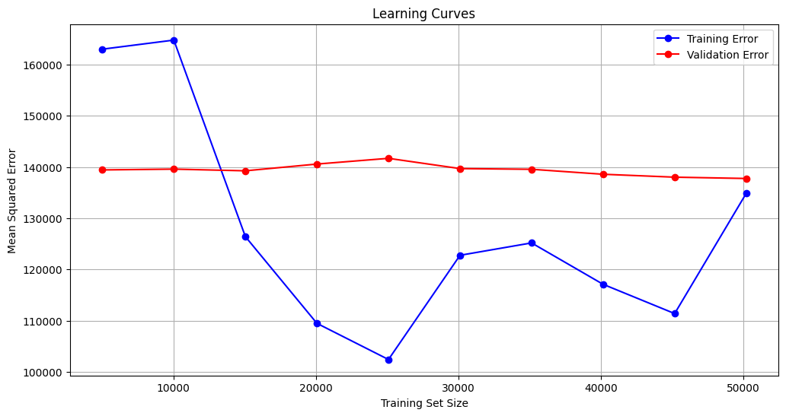
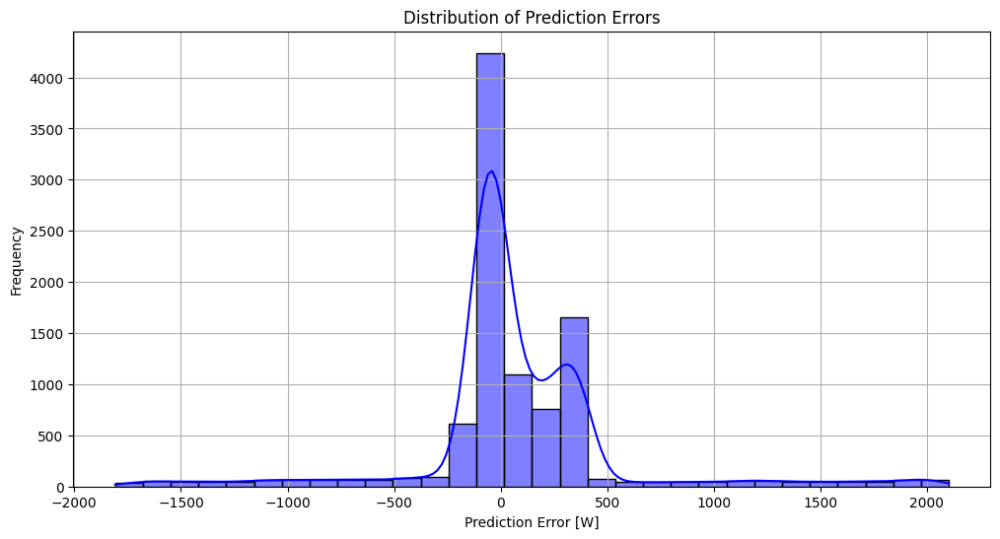

## Project
Micro gas turbine energy consumption  

## Info
Using data from an experiment done using a micro gas turbine, the idea's to predict its energy usage. This model can then help inform decisions on the tooling itself, as its performance can be emulated virtually via a predictive ML model, so it can be tested on a different environment and the results of that test can be treated as being reasonably accurate, depending on model performance on emulating its true behavior. 

Ideally more machinery or tooling can be more accurately simulated, to help inform decisions on their use, and drive business decisions. NVDIA seems to want to venture into simulation via ML as well (https://developer.nvidia.com/blog/develop-physics-informed-machine-learning-models-with-graph-neural-networks/), which personally I admire a lot, and am trying to eventually get similar work done in that area too, starting with application of ML to real-world tooling or infrastructure processes through my understanding of it.  

### Models
* Regression  

### Performance
* The learning curves show that, although the error increases with training size, it does eventually plateu and goes down slightly
    * Will need to implement model optimization techniques to help lower error
* The error distribution is centered around zero, which is good, but should ideally be symmetrical around zero as well

### Regression
#### Learning curve:
  

#### Error distribution:
  

### Application
Using the test sets: 

  

  

It does well for both test sets, as predicted consumption curve is close to measured curve using for both.  

#### Practical:
* Predict future energy consumption based on past data, to enables better energy management and planning, helping utilities balance supply and demand
* Predict power requirements to manage battery charge and discharge cycles effectively, to help extend battery life and ensure reliable power supply in applications like electric vehicles and renewable energy storage   

## Notebook
https://colab.research.google.com/drive/1wD2YNJqh0A_YSL2IvcBuuTxrqtdLeyrE#scrollTo=y0Sa7Ikcbe0F  

## References
Knowledge-Guided Learning of Temporal Dynamics and its Application to Gas Turbines. 
By Pawel Bielski, Aleksandr Eismont, Jakob Bach, Florian Leiser, Dustin Kottonau, and Klemens Böhm. 2024

Published in 15th ACM International Conference on Future Energy Systems (e-Energy '24), Singapore 

Link: https://archive.ics.uci.edu/dataset/994/micro+gas+turbine+electrical+energy+prediction