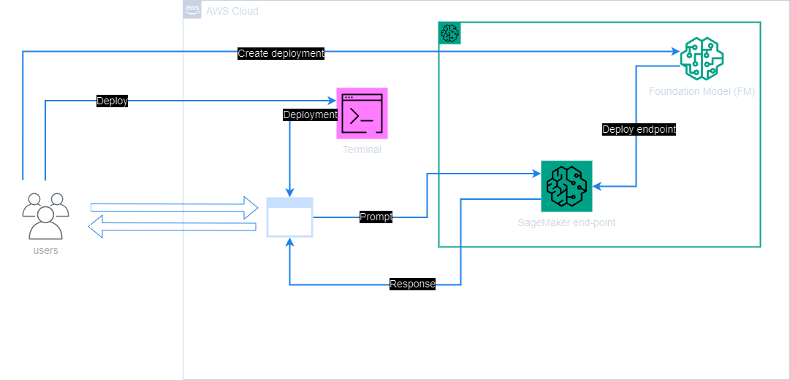

## Project
Retrieval Augmented Generation  

## Info
The purpose of this exercise was to implement a Retrieval Augmented Generation (RAG) system using LangChain, specifically tailored for question answering based on a custom dataset.  

A HuggingFace embedding model was used to create embeddings for each document in the knowledge library, the relevant documents were identified, and were combined with the original prompt/question and then sent to the Amazon SageMaker LLM to generate an answer.  

The Q&A application with was then built with LangChain, through the integration of SageMaker endpoints, then the dataset was prepared, via appropriate formatting of the dataset to build the knowledge database to be used for answering questions.  

## Schematic:  
  
*Figure 1 - Project schematic.*  

## Result
  
*Figure 2 - Functionality illustration.*  

  
*Figure 3 - Functionality illustration.*  

The result of the exercise was an implemented system that leverages the capabilities of LangChain, SageMaker, and embedding models to perform effective question answering using a custom dataset.