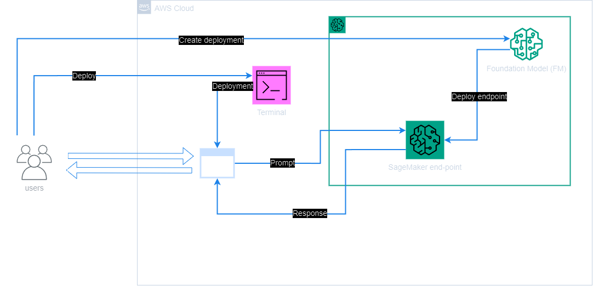
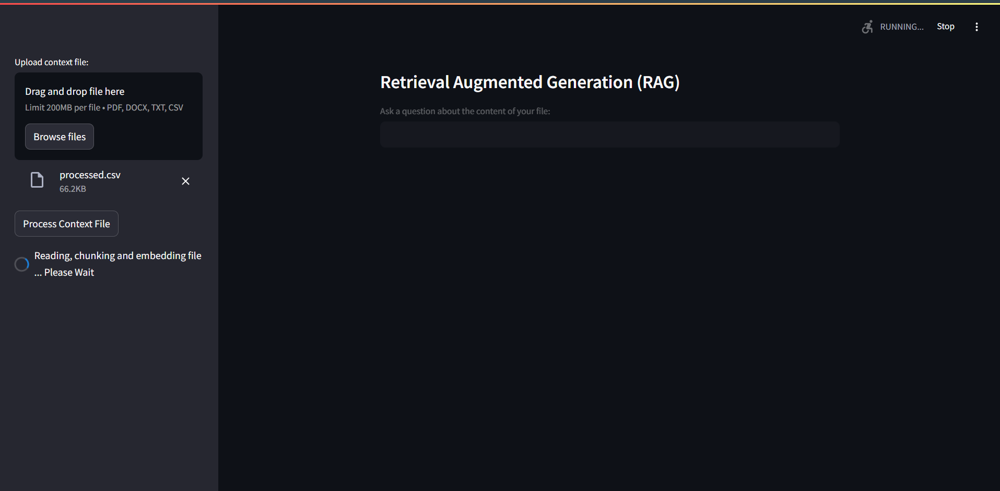
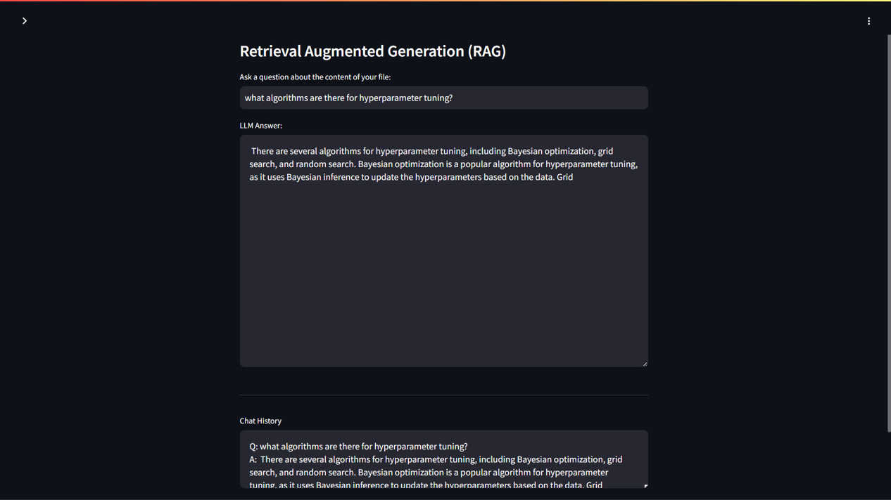

## Project
Retrieval Augmented Generation<br><br>

## Info
The purpose of this exercise was to implement a Retrieval Augmented Generation (RAG) system using LangChain, specifically tailored for question answering based on a custom dataset.<br>

A HuggingFace embedding model was used to create embeddings for each document in the knowledge library, the relevant documents were identified, and were combined with the original prompt/question and then sent to the Amazon SageMaker LLM to generate an answer.<br>

The Q&A application with was then built with LangChain, through the integration of SageMaker endpoints, then the dataset was prepared, via appropriate formatting of the dataset to build the knowledge database to be used for answering questions.<br><br><br>


## Architecture<br><br>
<br><br><br>
*Project architecture.*<br><br><br>

## Implementation
<br><br><br>
*Custom dataset loading.*<br><br><br>

<br><br><br>
*Functionality illustration.*<br><br><br>

## Performance
An example question was:<br>

```
What algorithms are there?

```

<br><br>For which the response was:<br>

> <br>There are several algorithms for hyperparameter tuning, including Bayesian optimization, grid search, and random search. Bayesian optimization is a popular algorithm for hyperparameter tuning, as it uses Bayesian inference to update the hyperparameters based on the data. Grid search is another popular algorithm, but it can be computationally expensive. Random search is a simpler algorithm that randomly samples hyperparameters. Grid<br><br>

<br><br><br>

In evaluating both the retrieval component (how well the system selects relevant documents) and the generation component (the quality and accuracy of the answers generated by the LLM), it seemed to provide a correct response to the question as showcased above, that's both relevant and informative, therefore both components seem to have been well implemented, but with more performance improvements it could be more concise and accurate.<br><br><br>

## Outcome
The result of the exercise was an implemented system that leverages the capabilities of LangChain, SageMaker, and embedding models to perform effective question answering using a custom dataset.