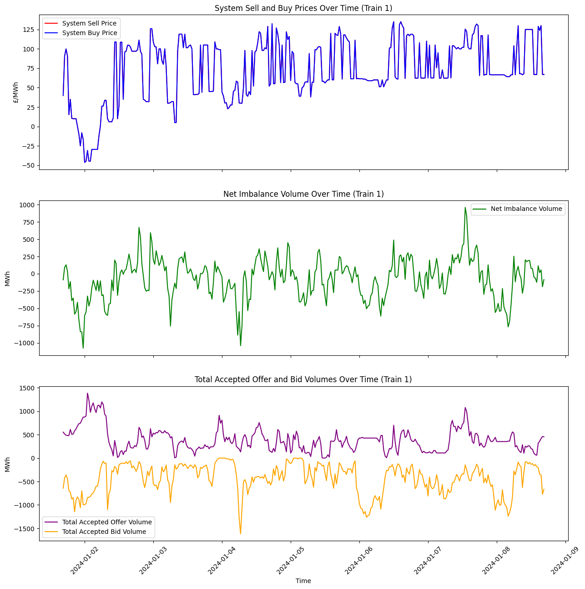
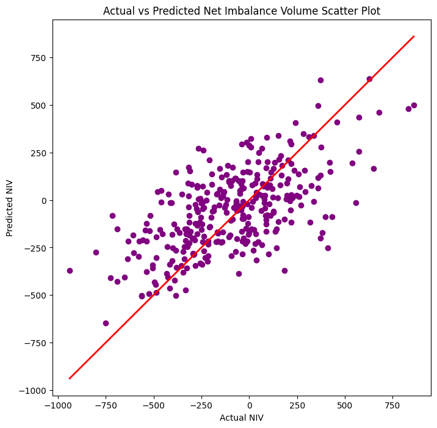
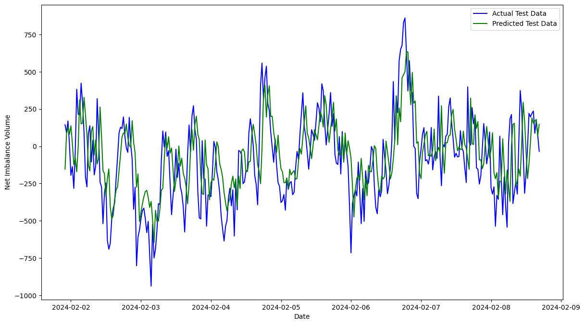

## Project
Imbalance Pricing Insights<br><br>

## Info
The wholesale electricity market is set up so that supply should always meet demand on the transmission system, thorough ensuring the contracts between parties including organizations that require electricity for their customers (suppliers) and organizations that produce electricity (generators) are such that balancing actions given to a party, are in accordance with agreed rules, to either increase or decrease generation, or increase or decrease demand, depending on the appropriate balancing action, and the dataset utilized pertains to this balancing act, more specifically referred to as *imbalance pricing*.<br><br>

#### Energy market:<br><br>
<br><br>
*Figure 1 - General market behavior overview.*<br><br>

*Figure 1* helps to determine the market conditions affecting system sell and buy prices, which helps to understand the context in which factors affecting the algorithm's performance as it tries to forecast future trends.<br><br>

System sell prices tend to increase during periods of high demand, and this correlation suggests that when demand is high, the cost to purchase or balance the grid increases, leading to higher sell prices.<br><br>

#### Imbalance pricing:<br><br>
<br><br>
*Figure 2 - System buy and sell prices, Net Imbalance Volume & total accepted offer bid volumes over time.*<br><br>

Above, are key important aspects of the data acquired on energy trading under energy balancing. The *buy/sell price* fluctuates based on market conditions (supply & demand), the *net imbalance volume determines* the frequency and magnitude at which the system experiences imbalance, and the *total accepted bid and offers volumes* reflect the amount of energy accepted for generation (offer volumes) or consumption reduction (bid volumes) by the market operator to optimally balance supply and demand, so offers (generation increases or demand decreases) increase, as bids (generation decreases or demand increases) decrease, which achieves balance.<br><br>
For unlocking value from this data, certain strategic insights should be determined. A way to do this, could be through machine learning models to derive valuable insights based on acquired data through volume / price forecasting. A large benefit of this type of prediction / forecasting, helps to inform trading strategies, with:
* *Price* - Where bids can be higher during anticipated price spikes and lower during anticipated price drops, to improve the chance of successful bids, to optimizing market participation.<br><br>
* *Accepted offer volume* - By knowing when there is likely to be higher acceptance, they can submit more competitive bids that align with market conditions to increase the likelihood of acceptance.<br><br>
* *Net imbalance volume* - In a short system, prices are typically higher, and knowing this in advance can help producers maximize revenue, therefore knowing when the system is likely to be short (positive NIV) or long (negative NIV) allows market participants to adjust their trading strategies accordingly.<br><br>


### Models
* Long Short-term Memory (LSTM)<br><br>

<br><br>
*Figure 3 - LSTM model architecture.*<br><br>

It is a type of recurrent neural network (RNN) where the output from the previous step is fed as input to the current step, and as shown in *Figure 2*, input $x$ is passed to the hidden layer $h$, which has a loop for memory storage, passing information to the output $y$. The hidden layers act as short-term memory, carrying information to the next set of layers.<br><br>

### Performance
#### System Buying / Selling Price
* With a MSE of 889.65, its relatively high, indicating model's predictions have significant errors, with RMSE being 29.82 it suggests the time-series data isnt being captured effectively 
* A relatively low R2 Score of 0.22, indicates poor capture of the variability in the data and shows model is underfitting 
* Most points in predicted vs actual prices are not very close to the ideal $x = y$ line, supporting the idea of poor model performance
<br><br>

#### LSTM
##### Actual vs Prediction:<br><br>
<br><br>
*Figure 4 - Actual vs predicted prices scatter plot.*<br><br>

##### Scores:<br><br>
```
MSE: 889.6546507884278
RMSE: 29.82707915281729
MAE: 22.571276680650104
R2 Score: 0.22286856315930337

```
<br><br>

#### Total Accepted Offer Volume
* With an MSE of 30139.02, and RMSE of 173.60 it's also a poorly performing model that's off by a rather large magnitude
* However, with an R2 score of 0.77, is a relatively high R2 score, indicating that the model fits the data reasonably well and captures most of the variability
* This varied performance in the model's evaluation is well reflected by the predicted vs. actual plot, with some values being concentrated close to the ideal line, but some concentrated away from it
<br><br>

#### LSTM
##### Actual vs Prediction:<br><br>
<br><br>
*Figure 5 - Actual vs predicted total accepted volume scatter plot.*<br><br>

##### Scores:<br><br>
```
MSE: 30139.02781578129
RMSE: 173.60595558845696
MAE: 130.18930671051166
R2 Score: 0.7708270743038639

```
<br><br>

#### Net Imbalance Volume
* An MSE of 45953.82 is even way more off than other models, and a large RMSE of 214.36, and an R2 Score of 0.20, this model shows an even more chaotic performance in prediction than the others
* The scatter-plot reflects this chaos as well
<br><br>

#### LSTM
##### Actual vs Prediction:<br><br>
<br><br>
*Figure 6 - Actual vs predicted NIV scatter plot.*<br><br>

##### Scores:<br><br>
```
MSE: 45953.82601143528
RMSE: 214.36843520312237
MAE: 167.89512390198354
R2 Score: 0.20173916151965587

```
<br><br>

### Application
##### System buy / sell price model:<br><br>
<br><br>
*Figure 7 - Model system buy & sell price prediction on test_1 dataset.*<br><br>

##### Accepted offer volume:<br><br>
<br><br>
*Figure 8 - Model total accepted offer volume prediction on test_1 dataset.*<br><br>

##### Net imbalance volume:<br><br>
<br><br>
*Figure 9 - Model NIV prediction on test_1 dataset.*<br><br>

Each model had different evaluation performances, with the first (price) being reasonable, with differing performance with each subsequent one, which may be explained by complexity of curves, as its much more difficult to predict a curve with a lot of variance than one with fewer which is a likely reason, however further analysis and model tuning will be necessary to see if this, or other factors are at play here.<br><br>

#### Practical:
* Generally inform trading strategies based on forecast<br><br><br>


## Interactive Application
* [Imbalance Pricing Forecast Model](https://github.com/JeffM-Code/ImbalancePricingForecastModel)<br><br>

## Notebook
[Static](https://github.com/JeffM-Code/PortfolioWork/blob/main/ML/ImbalancePricing/ML_imbalance_pricing.ipynb)<br><br>
[Interactive](https://colab.research.google.com/drive/1So3vq08OLjLI7fcQpDyyJb2-iNQ7bnpa#scrollTo=A4ADKW3urL7y)<br><br>


## References
Imbalance pricing guidance.<br>

Elexon<br>

Link: https://www.elexon.co.uk/documents/training-guidance/bscguidance-notes/imbalance-pricing/#:~:text=After%20the%20end%20of%20the,be%20subject%20to%20imbalance%20charges<br><br>

Long short-term memory (LSTM) RNN in Tensorflow.<br>

Geeks for geeks<br>

Link: https://www.geeksforgeeks.org/long-short-term-memory-lstm-rnn-in-tensorflow/<br><br>

System sell and buy prices.<br>

Generation by fuel type.<br>

Rolling system demand.<br>

Elexon<br>

Links:<br>
https://bmrs.elexon.co.uk/system-prices,<br>
https://bmrs.elexon.co.uk/generation-by-fuel-type,<br>
https://bmrs.elexon.co.uk/rolling-system-demand