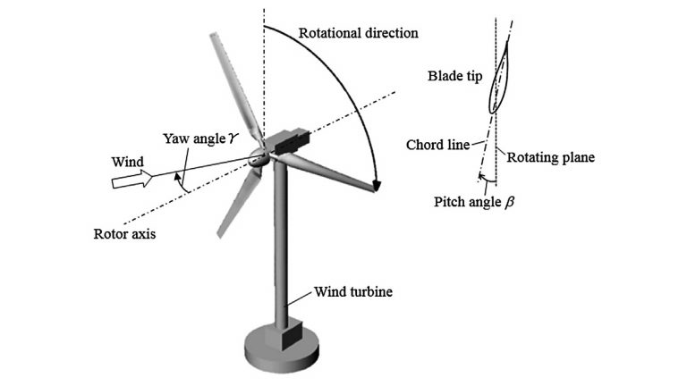
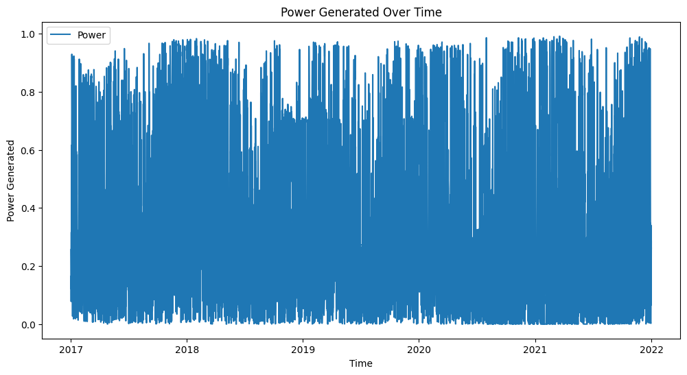
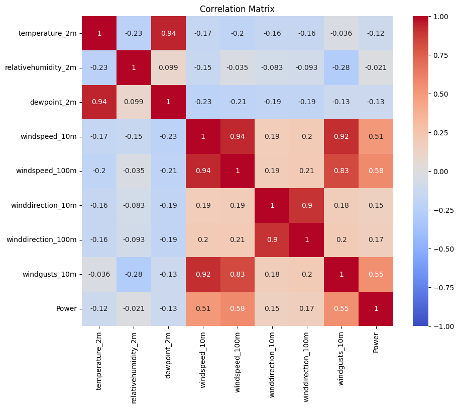
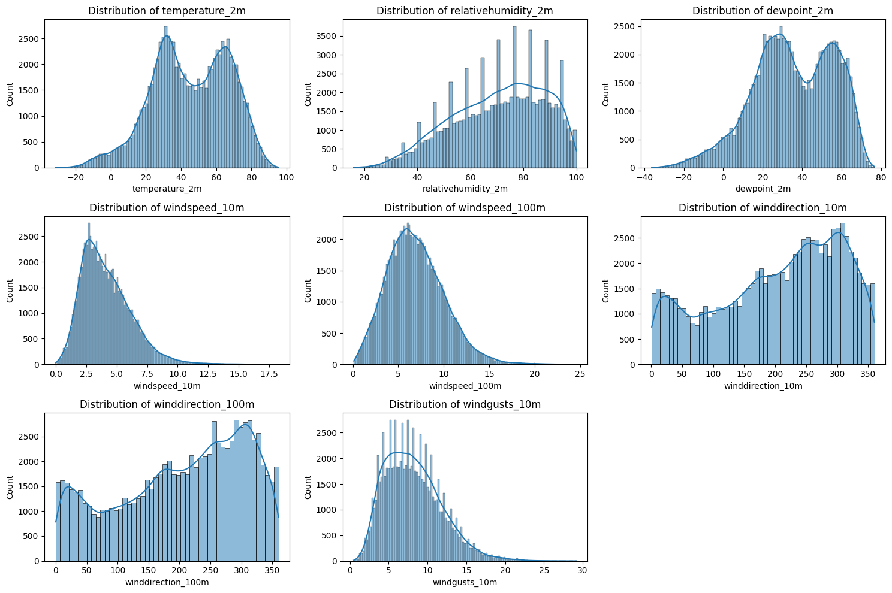
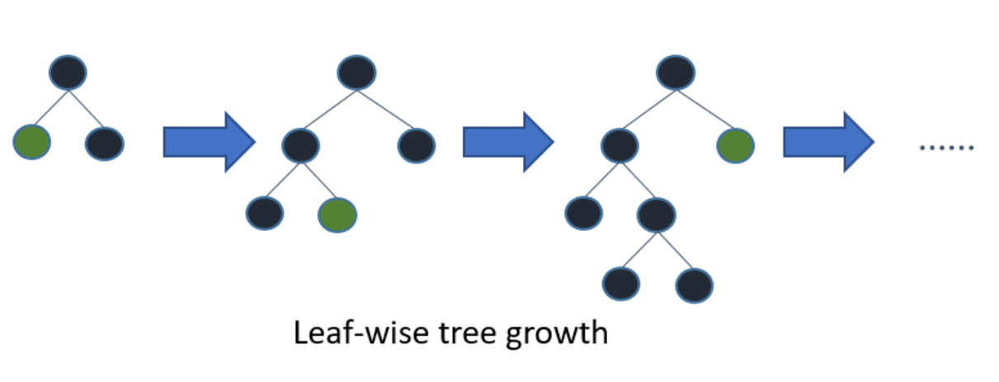
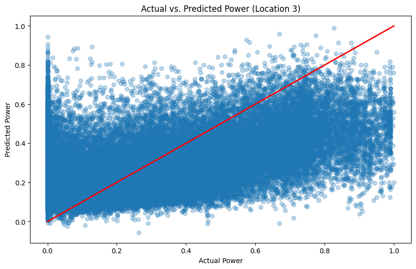
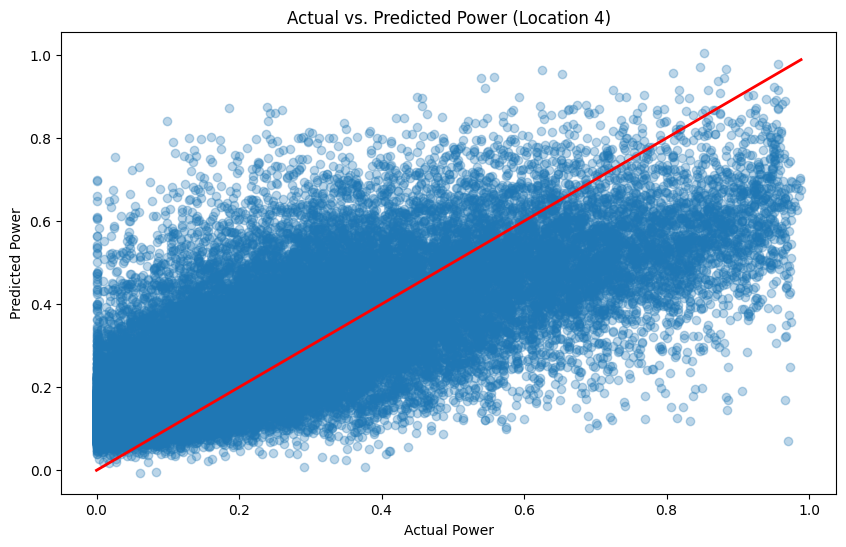
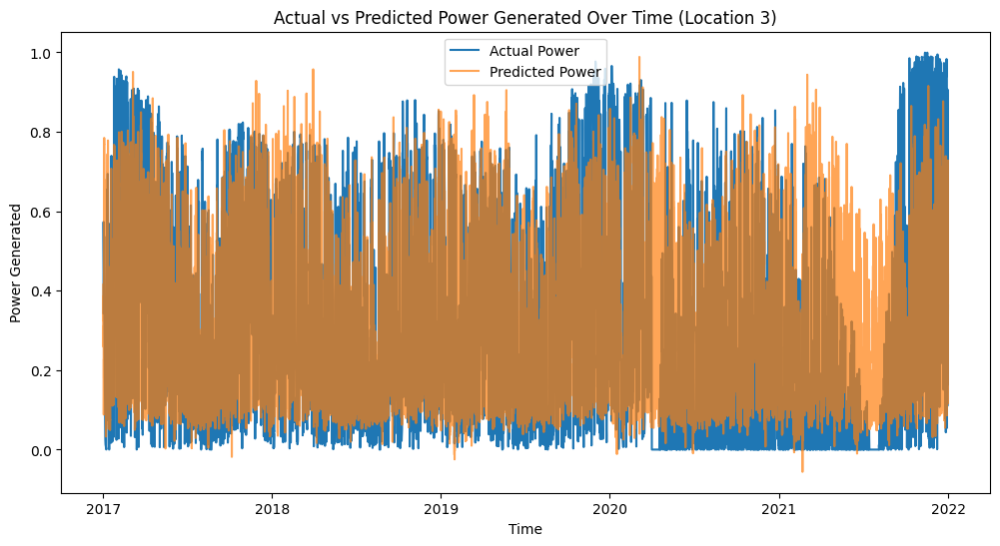
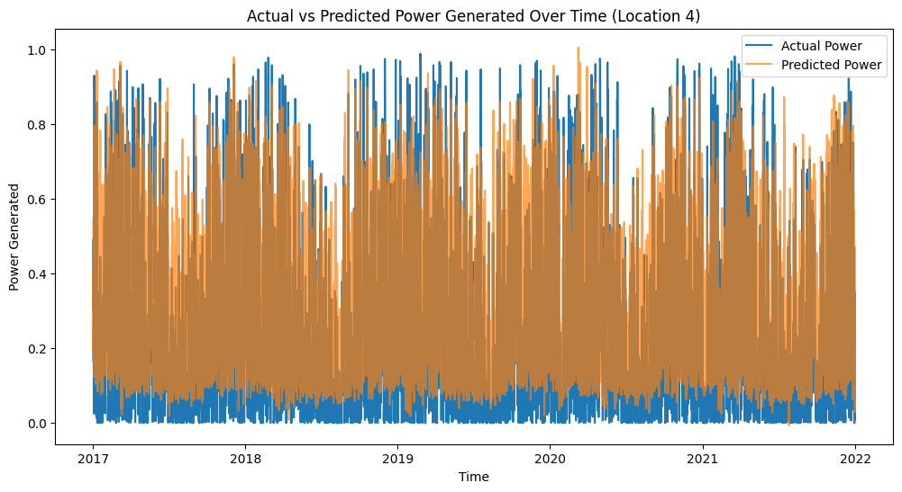

## Project
Wind Turbine Generation<br><br>

## Info
Using a dataset of a unique compilation of field based meteorological observations and wind turbine power generation, the goal is to predict its power output given the conditions of a wind turbine capability to generate power, i.e., wind, through attributes of meteorological data.<br><br>

#### Onshore turbine:<br><br>
<br><br>
*Figure 1 - Onshore turbine illustration.*<br><br>

#### Power generated:<br><br>
<br><br>
*Figure 2 - Power generated over time.*<br><br>

Given the data, this is how each measured attribute may affect turbine power generation:<br>
### Miscellaneous:<br>
These don't really effect power generation very much, but are worth consideration, since they are part of the measurement.<br><br>
* *Time* - Certain times of day, or seasons may have particulalry high wind speeds<br>

* *Temperature* - Temperature affects air density, which in turn affects the kinetic energy available in the wind, hence since colder air is denser it can therefore carry more energy, potentially leading to higher power generation<br>

* *Relative humidity* - Higher humidity translates to increased water vapor in the air, which in turn could slightly reduce air density<br>

* *Dew point* - Dew point determines air moisture content, its impact on air density and wind power production is generally minor<br><br>

### Crucial:
* *Wind speed* - Wind speed has a cubic relationship with power generation, meaning that small increases in wind speed lead to large increases in power output, and this relationship underpins the importance of siting wind turbines in areas with consistently high wind speeds to maximize energy production, since even modest increases in average wind speed result in significantly high energy yields<br>

$$P ∝ V^3$$
<br>

* *Wind direction* - Wind direction affects power generation by determining how well the wind turbine can capture the wind, as wind turbines are typically designed to face into the wind (upwind direction), to maximize efficiency. A shift in the direction of wind causing turbine blade misalignment results in the decrease of efficiency of wind capture. So, to optimize power generation, modern wind turbines are equipped with yaw control systems that rotate the turbine to face the prevailing wind direction for maintaining optimal alignment with wind direction, ensuring maximum energy capture and efficient power generation<br><br>

#### Heatmap:<br><br>
<br><br>
*Figure 3 - Correleation heatmap of data.*<br><br>

Features with high correlation with the target variable (e.g., Power) are likely to be more important for the model, and these features can be prioritized for model development. for instance, since windspeed_100m has a high positive correlation with Power (which it seems to show evidently, given the heatmap), it is likely an important predictor.<br><br>

Features that are highly correlated with each other (e.g., correlation close to 1 or -1) may introduce multicollinearity, which can make the model coefficients unstable and inflate the variance.<br><br>

#### Distributions:<br><br>
<br><br>
*Figure 4 - Distribution plots of data.*<br><br>

Features with skewed distributions may need to be transformed (e.g., through log or square root transformations) to improve model performance, so for instance since dewpoint_2m is right-skewed, applying a log transformation might help in normalizing the distribution, making it more suitable for the model.<br><br>

### Models
* Light Gradient Boosting Machine<br><br>

<br><br>
*Figure 5 - Illustration of light gradient boosting machine model.*<br><br>


A LightGBM builds decision trees in a leaf-wise manner, focusing on splitting the leaves that contribute most to reducing the loss, which results in efficient and accurate models that can handle large datasets and complex patterns.

It uses a leaf-wise tree growth strategy for building decision trees as demonstrated in *Figure 5* with steps:

* Step 1: Start with a root node and split it using the feature that minimizes the loss the most.<br><br>
* Step 2: Among the resulting leaves, select the leaf that, if split, would reduce the loss the most significantly.<br><br>
* Step 3: Continue this process by focusing on and splitting the most promising leaf at each step, leading to a more efficient and targeted tree growth.<br><br>

Which captures complex patterns in the data more effectively, resulting in higher accuracy and efficiency.<br><br>

### Performance
Generally, the lower RMSE value, the better the model performance.<br><br>

* RMSE on Location 3 test data (0.226) means that, on average, the model's predictions for Location 3 deviate from the actual power values by approximately 0.226 units, so the model might be capturing most of the patterns in the data but may be missing some finer details or variability specific to Location 3.<br><br>

* RMSE on Location 5 (0.156) is lower than that of Location 3, indicating that the model performs better on Location 4 compared to Location 3, and since the predictions are closer to the actual values, this suggests this model captures the patterns and variability in Location 4's data more effectively<br><br>

### Light Gradient Boosting Machine
#### Actual vs predicted on test set 1:<br><br>
<br><br>
*Figure 6 - Actual vs predicted plot on test set 1 (Location 3).*<br><br>

#### Scores:<br><br>
```
RMSE: 0.22613372801507597

```
<br>

#### Actual vs predicted on test set 2:<br><br>
<br><br>
*Figure 7 - Actual vs predicted plot on test set 1 (Location 3).*<br><br>

#### Scores:<br><br>
```
RMSE: 0.15550526409917642

```
<br>


### Application
Using the test sets:<br>

#### Power prediction:<br><br>
<br><br>
*Figure 8 - Power prediction using location 3 as test.*<br><br>

#### Power prediction:<br><br>
<br><br>
*Figure 9 - Power prediction using location 4 as test.*<br><br>

Further model optimizations or different model selction may be necessary to capture the complexity of this dataset, for more accurate predictions, therefore forecasting.<br><br>

#### Practical:
* It can help forecast supply, such that one can predict and anticipate wind turbine energy output based on weather conditions or meteorological data (e.g., temperature, wind speed, and humidity)<br><br>

## Notebook
[Static](https://github.com/JeffM-Code/PortfolioWork/blob/main/ML/WindTurbinePower/ML_wind_turbine_prediction.ipynb)<br><br>
[Interactive](https://colab.research.google.com/drive/1-YwDb78CB7vbcUK61aJ-ULDmsM-JcB1l#scrollTo=9Ho4kDMiSpRx)<br><br>

## References
Wind Power Generation Data - Forecasting.<br>

Kaggle.<br>

Link: https://www.kaggle.com/datasets/mubashirrahim/wind-power-generation-data-forecasting?select=Location1.csv<br><br>

A meteorological data set and wind power density from selective locations of Tamil Nadu, India: Implication for installation of wind turbines.<br>

Science Direct.<br>

Link: https://www.sciencedirect.com/science/article/pii/S277280992200017X<br><br>

Steering Wind Turbines Creates Greater Energy Potential.<br>

AIP Publishing.<br>

Link: https://publishing.aip.org/publications/latest-content/steering-wind-turbines-creates-greater-energy-potential/<br><br>


What is LightGBM, How to implement it? How to fine tune the parameters?<br>

Medium.<br>

Link: https://medium.com/@pushkarmandot/https-medium-com-pushkarmandot-what-is-lightgbm-how-to-implement-it-how-to-fine-tune-the-parameters-60347819b7fc